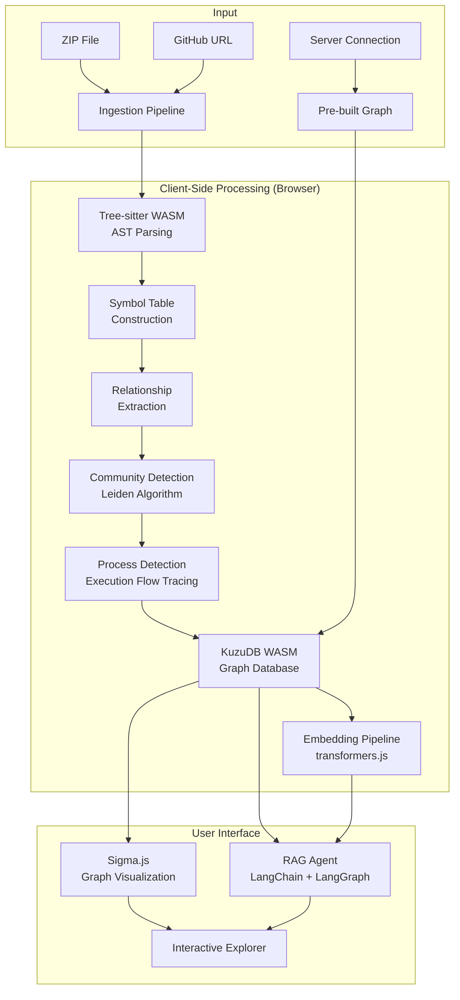
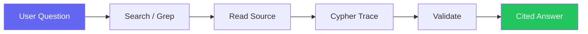
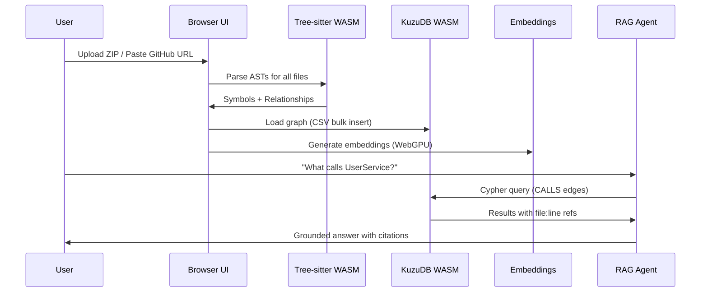

<p align="center">
  
</p>

<h1 align="center">◇ PolytraceAI</h1>

<p align="center">
  <strong>Zero-Server Code Intelligence Engine — Graph RAG that runs entirely in your browser.</strong>
</p>

<p align="center">
  <a href="#-quick-start">Quick Start</a> •
  <a href="#-features">Features</a> •
  <a href="#-architecture">Architecture</a> •
  <a href="#-tech-stack">Tech Stack</a> •
  <a href="#-agent-tools">Agent Tools</a> •
  <a href="#-supported-languages">Languages</a> •
  <a href="#-contributing">Contributing</a>
</p>

<p align="center">
  
  
  
  
</p>

---

## 📖 What is PolytraceAI?

**PolytraceAI** turns any GitHub repository or local ZIP file into an **interactive knowledge graph** with a built-in **AI RAG Agent** — all running 100% client-side in your browser. No servers, no sign-ups, no data ever leaves your machine.

Drop in a repo →  Get a visual dependency graph → Chat with an AI agent that understands your code's structure, call flows, and architecture.

---

## ⚡ Quick Start

```bash
# Clone the repository
git clone https://github.com/HimanshuxAI/byteeee.git
cd byteeee

# Install dependencies
npm install

# Start the development server
npm run dev
```

Open [http://localhost:5173](http://localhost:5173) and either:

1. **Upload a `.zip`** of your codebase
2. **Paste a GitHub URL** to clone directly in-browser
3. **Connect to a running PolytraceAI server** for pre-indexed repos

---

## 🚀 Features

### 🕸️ Knowledge Graph Generation
- Automatically maps **files, folders, functions, classes, interfaces, methods** and their relationships
- Detects **CONTAINS, DEFINES, IMPORTS, CALLS, EXTENDS, IMPLEMENTS** edges
- Runs **Leiden community detection** to discover functional clusters
- Traces **execution flows** (Process nodes) across the codebase

### 🤖 Graph RAG Agent
- Chat with your codebase using **7 specialized tools**
- Supports **6 LLM providers** — bring your own API key
- Grounded responses with **file:line citations**
- Streams tool calls and reasoning in real-time (Cursor-like UX)

### 🔒 100% Client-Side
- All parsing, graph construction, embeddings, and querying happen in-browser
- Uses **WebAssembly** (Tree-sitter, KuzuDB) and **WebGPU** for native-speed performance
- Your code never touches any server

### 📊 Interactive Visualization
- **Sigma.js** WebGL graph renderer with ForceAtlas2 physics layout
- Color-coded nodes by type and community membership
- Filter by node type, edge type, depth, and search results
- Click-to-inspect with source code panel

---

## 🏗️ Architecture

### High-Level System Diagram



### Ingestion Pipeline (9 Phases)

The pipeline transforms raw source code into a queryable knowledge graph:

| Phase | Name | Progress | Description |
|-------|------|----------|-------------|
| 1 | **Extraction** | 0–15% | Unzip files or read cloned repo |
| 2 | **Structure** | 15–30% | Build folder/file hierarchy (`CONTAINS` edges) |
| 3 | **Parsing** | 30–70% | Tree-sitter AST parsing → Functions, Classes, Methods, Interfaces (`DEFINES` edges) |
| 4 | **Imports** | 70–82% | Resolve import/require statements → file-level `IMPORTS` edges |
| 5 | **Call Resolution** | 82–88% | Trace function calls across files → `CALLS` edges with confidence scores |
| 6 | **Heritage** | 88–92% | Extract class inheritance → `EXTENDS` and `IMPLEMENTS` edges |
| 7 | **Community Detection** | 92–98% | Leiden algorithm clusters tightly-coupled code into Communities |
| 8 | **Process Detection** | 98–99% | Trace execution flows from entry points → Process nodes with `STEP_IN_PROCESS` edges |
| 9 | **Complete** | 100% | Graph loaded into KuzuDB WASM, ready for querying |

### Graph Schema

```mermaid
erDiagram
    Folder ||--o{ File : CONTAINS
    File ||--o{ Function : DEFINES
    File ||--o{ Class : DEFINES
    File ||--o{ Interface : DEFINES
    File ||--o{ Method : DEFINES
    File ||--o{ File : IMPORTS
    Function ||--o{ Function : CALLS
    Method ||--o{ Function : CALLS
    Class ||--o{ Class : EXTENDS
    Class ||--o{ Interface : IMPLEMENTS
    Function }o--|| Community : MEMBER_OF
    Class }o--|| Community : MEMBER_OF
    Function }o--|| Process : STEP_IN_PROCESS
    Method }o--|| Process : STEP_IN_PROCESS
```

| Node Type | Description | Properties |
|-----------|-------------|------------|
| `Folder` | Directory in the project | `name`, `filePath` |
| `File` | Source code file | `name`, `filePath` |
| `Function` | Standalone function | `name`, `filePath`, `startLine`, `endLine`, `isExported` |
| `Class` | Class declaration | `name`, `filePath`, `startLine`, `endLine`, `isExported` |
| `Interface` | Interface/type declaration | `name`, `filePath`, `startLine`, `endLine` |
| `Method` | Method inside a class | `name`, `filePath`, `startLine`, `endLine` |
| `Community` | Auto-detected cluster (Leiden) | `label`, `cohesion`, `symbolCount` |
| `Process` | Execution flow trace | `label`, `processType`, `stepCount` |

| Edge Type | Meaning | Example |
|-----------|---------|---------|
| `CONTAINS` | Folder → File hierarchy | `src/` contains `utils.ts` |
| `DEFINES` | File → Symbol definition | `auth.ts` defines `loginUser()` |
| `IMPORTS` | File → File dependency | `app.ts` imports `auth.ts` |
| `CALLS` | Function invocation or DI | `handleLogin()` calls `validateToken()` |
| `EXTENDS` | Class inheritance | `AdminUser` extends `BaseUser` |
| `IMPLEMENTS` | Interface implementation | `UserService` implements `IUserService` |
| `MEMBER_OF` | Symbol → Community membership | `validateToken` ∈ Auth Cluster |
| `STEP_IN_PROCESS` | Symbol → Execution flow | `handleLogin` is step 1 in "Login Flow" |

---

## 🛠️ Agent Tools

The RAG agent has **7 tools** optimized for code exploration:

| Tool | Description | Best For |
|------|-------------|----------|
| `search` | Hybrid search (BM25 + semantic + RRF), grouped by process | Finding code by concept or keyword |
| `cypher` | Execute Cypher queries against the graph; auto-embeds `{{QUERY_VECTOR}}` | Structural queries (callers, imports, inheritance trees) |
| `grep` | Regex pattern match across all files | Exact strings, TODOs, error codes |
| `read` | Read full file content with smart path matching | Viewing source code after search/grep |
| `overview` | Codebase map — all clusters, processes, and cross-cluster dependencies | Getting oriented in a new codebase |
| `explore` | Deep dive on any symbol, cluster, or process | Understanding a specific component |
| `impact` | Impact analysis — what breaks if you change X | Assessing risk before refactoring |

### Agent Tool Flow



---

## 🧠 LLM Provider Support

PolytraceAI supports **6 LLM providers** — configure via the in-app Settings panel:

| Provider | Models | Notes |
|----------|--------|-------|
| **OpenAI** | GPT-4o, GPT-4o-mini, etc. | Standard OpenAI API |
| **Azure OpenAI** | Any deployed model | Enterprise Azure deployments |
| **Google Gemini** | Gemini 2.0 Flash, Pro, etc. | Google AI Studio API key |
| **Anthropic** | Claude Sonnet, Opus, Haiku | Anthropic API key |
| **Ollama** | Llama, Mistral, Qwen, etc. | Local models, no API key needed |
| **OpenRouter** | 100+ models | Unified API for any model |

---

## 🌐 Supported Languages

PolytraceAI uses **Tree-sitter WASM** for universal AST parsing across **12 languages**:

| Language | Extensions | AST Features |
|----------|-----------|--------------|
| JavaScript | `.js`, `.jsx` | Functions, Classes, Imports, Calls |
| TypeScript | `.ts`, `.tsx` | Functions, Classes, Interfaces, Generics |
| Python | `.py` | Functions, Classes, Imports, Decorators |
| Java | `.java` | Classes, Methods, Interfaces, Inheritance |
| C | `.c`, `.h` | Functions, Structs, Includes |
| C++ | `.cpp`, `.hpp` | Classes, Methods, Templates, Namespaces |
| C# | `.cs` | Classes, Methods, Interfaces, Properties |
| Go | `.go` | Functions, Structs, Interfaces, Packages |
| Rust | `.rs` | Functions, Structs, Traits, Impls |
| PHP | `.php` | Functions, Classes, Namespaces |
| Ruby | `.rb` | Classes, Methods, Modules |
| Swift | `.swift` | Classes, Structs, Protocols, Extensions |

---

## 📁 Project Structure

```
byteeee/
├── public/                    # Static assets (WASM files, demo video)
├── src/
│   ├── components/            # React UI components (20+)
│   │   ├── DropZone.tsx       # File upload / GitHub clone / Server connect
│   │   ├── GraphCanvas.tsx    # Sigma.js graph renderer
│   │   ├── RightPanel.tsx     # Code viewer + AI chat (tabbed)
│   │   ├── Header.tsx         # Navigation + search + repo switcher
│   │   ├── LandingPage.tsx    # Marketing landing page
│   │   ├── SettingsPanel.tsx  # LLM provider configuration
│   │   └── ...
│   ├── core/
│   │   ├── embeddings/        # WebGPU/WASM embedding pipeline (transformers.js)
│   │   ├── graph/             # Knowledge graph types and factory
│   │   ├── ingestion/         # 9-phase ingestion pipeline
│   │   │   ├── pipeline.ts    # Orchestrator
│   │   │   ├── parsing-processor.ts    # Tree-sitter AST parsing
│   │   │   ├── call-processor.ts       # Cross-file call resolution
│   │   │   ├── community-processor.ts  # Leiden community detection
│   │   │   ├── process-processor.ts    # Execution flow tracing
│   │   │   └── ...
│   │   ├── kuzu/              # KuzuDB WASM adapter + schema + CSV loader
│   │   └── llm/               # LangChain agent, tools, context builder
│   ├── hooks/                 # React hooks (useAppState, useSigma, useAgent)
│   ├── lib/                   # Graph adapter, constants
│   ├── services/              # Git clone, server connection, ZIP extraction
│   ├── workers/               # Web Worker for ingestion pipeline
│   └── vendor/                # Vendored Leiden algorithm
├── index.html
├── vite.config.ts
├── package.json
└── tsconfig.json
```

---

## 🔧 Tech Stack

| Layer | Technology | Purpose |
|-------|-----------|---------|
| **Frontend** | React 18, TypeScript | UI framework |
| **Styling** | Tailwind CSS 4 | Utility-first CSS |
| **Bundler** | Vite 6 | Dev server + production build |
| **Graph Viz** | Sigma.js + Graphology | WebGL graph rendering + ForceAtlas2 physics |
| **AST Parsing** | Tree-sitter WASM | Language-agnostic code parsing |
| **Graph DB** | KuzuDB WASM | Embedded graph database with Cypher support |
| **Embeddings** | transformers.js (Xenova) | Client-side vector embeddings (WebGPU/WASM) |
| **AI Agent** | LangChain + LangGraph | ReAct agent with tool calling |
| **Community** | Leiden Algorithm (vendored) | Community/cluster detection |
| **Git** | isomorphic-git | In-browser Git clone |

---

## 📊 How It Works — End to End



---

## 🎨 Themes

PolytraceAI ships with **2 themes** — toggle from the header:

| Theme | Description |
|-------|-------------|
| **Dark** (X-Dark) | Twitter/X-inspired dark mode with blue accents |
| **White** (Cream Light) | Clean light mode with warm amber accents |

---

## 🔐 Privacy & Security

- ✅ **No server** — everything runs in your browser
- ✅ **No telemetry** — zero tracking or analytics
- ✅ **No data storage** — code stays in-memory, cleared on page close
- ✅ **GitHub PAT stays client-side** — never sent to any proxy
- ✅ **LLM API keys stored in localStorage** — never transmitted elsewhere

---

## 🤝 Contributing

We welcome contributions! Here's how:

1. **Fork** the repository
2. **Create a branch** (`git checkout -b feature/amazing-feature`)
3. **Commit** your changes (`git commit -m 'Add amazing feature'`)
4. **Push** to the branch (`git push origin feature/amazing-feature`)
5. **Open a Pull Request**

### Development

```bash
npm run dev      # Start dev server (http://localhost:5173)
npm run build    # Production build (tsc + vite build)
npm run preview  # Preview production build
```

> **Note:** Cross-Origin Isolation headers (`COOP/COEP`) are required for KuzuDB WASM's `SharedArrayBuffer`. The Vite config handles this automatically.

---

## 📄 License

This project is licensed under the **MIT License** — see the [LICENSE](LICENSE) file for details.

---

<p align="center">
  <strong>Built with ❤️ by <a href="https://github.com/HimanshuxAI">HimanshuxAI</a></strong>
</p>

<p align="center">
  <a href="https://github.com/HimanshuxAI/byteeee">⭐ Star us on GitHub</a>
</p>
